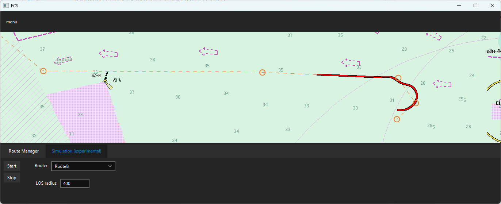

An Electronic Chart System with route manager to perform experiments on a map. 

A line-of-sight tracker and a ship dynamic model is put ontop of the simulator project.

---
Install: javafx13 
Run with VM arguments: --module-path "D:\javafx-sdk-13\lib" --add-modules=javafx.controls,javafx.fxml,javafx.swing
see also https://openjfx.io/openjfx-docs/#maven